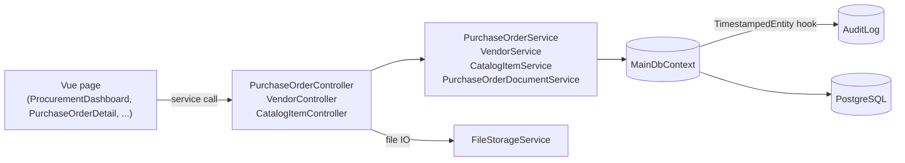

# Procurement (Reference Sample)

> **Status:** `reference-sample`
> **Removable in derived repos:** **yes — via `.ai/tasks/0003-remove-procurement-samples`**
> **Required by:** none — it's a learning reference

Procurement is the active reference sample shipped in NIE Template. It demonstrates a complete end-to-end vertical: a parent entity (`Vendor`), a child catalog (`CatalogItem`), a workflow entity (`PurchaseOrder` with `Lines`, `Approvals`, `Documents`), full CRUD controllers, services, DTOs, Mapster mappings, FE pages, FE services, route configuration, sidebar nav, role bundles, access functions, audit-log integration, file uploads via `PurchaseOrderDocument`, and an approval state machine driven by `EPurchaseOrderStatus`.

When a derived project clones the template, procurement remains in place so the project's developers can study a working pattern — how to wire a controller, how to use `RequireAccessFunction`, how `TimestampedEntity` triggers audit, how Mapster flattens nav properties, how a Vue page uses `@nietemplate/ui` primitives.

Once the project has built its own real entities by copying patterns from procurement, run task 0003 to scrub procurement entirely.

## Quick links

- 📁 [`files.md`](./files.md) — exhaustive file map
- ✅❌ [`do-dont.md`](./do-dont.md) — feature-specific rules (mostly: don't extend procurement; copy patterns into your own entities)
- 🎛️ [`customize.md`](./customize.md) — guidance for projects that ARE running procurement (rare)
- 🗑️ [`remove.md`](./remove.md) — full removal walkthrough (mirrors task 0003)
- 🔍 [`verify.md`](./verify.md) — proof procurement still works in the template

## Architectural shape

## Patterns this sample teaches

| Pattern | Where to look |
| --- | --- |
| Parent/child entity with cascade delete | `Vendor` ↔ `CatalogItem`; `PurchaseOrder` ↔ `PurchaseOrderLine` |
| Workflow with state machine | `PurchaseOrderController.Submit` and `ProcessApproval` driven by `EPurchaseOrderStatus` |
| Per-feature documents with FK linking entity | `PurchaseOrderDocument` → `Document` (instead of polymorphic `OwnerType`/`OwnerId`) |
| Mapster nav flattening | `MappingProfile.cs` PurchaseOrderDto config |
| Per-endpoint access function | `[RequireAccessFunction(AccessFunctionCodes.Api.ProcurementOrderApprove)]` on `ProcessApproval` |
| Approval chain seeded on submit | `Submit()` adds three `PurchaseOrderApproval` rows |
| FE service with form helpers | `purchaseOrderService.ts` |
| Sidebar nav driven by access functions | `usePermissions.ts` PRIMARY_NAV_ITEMS for procurement |
