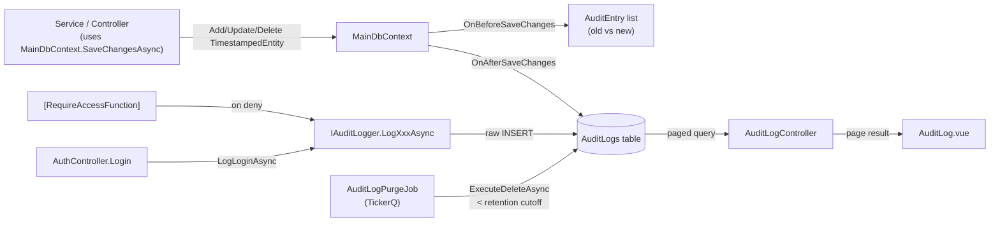

# Audit Logging

> **Status:** `core`
> **Removable in derived repos:** **no** — compliance and forensic requirements assume an audit trail
> **Required by:** `authentication` (login/logout entries), `authorization-access-functions` (denied + role changes), `tickerq-background-jobs` (purge job), every controller that touches sensitive data

The template captures audit events from two paths simultaneously:

1. **Automatic** — Every `TimestampedEntity` (including `Code`, `Document`, `Vendor`, `PurchaseOrder`, etc.) is tracked by an EF Core `SaveChanges` interceptor inside `NieTemplateDbContext`. Create / Update / Delete operations are diffed against the change tracker, serialized into JSON, and inserted into `AuditLogs` automatically — no developer call is required.
2. **Manual** — `IAuditLogger` exposes typed helpers (`LogLoginAsync`, `LogAccessDeniedAsync`, `LogFileUploadAsync`, `LogJobExecutedAsync`, `LogRoleAccessChangedAsync`, ...) for events that aren't entity mutations. Manual entries are inserted via raw SQL inside `AuditLogger.SaveEntryAsync` to avoid recursing back into the `SaveChanges` hook.

Every audit entry carries an `EAuditCategory` (`Data`, `Authentication`, `AccessControl`, `FileOperation`, `DataTransfer`, `System`), an `EAuditAction` (e.g. `Create`, `Login`, `RoleAssigned`, `FileUpload`), an `EAuditSeverity`, and request metadata (IP, user agent, correlation ID, session ID, request URL/method). A daily TickerQ job (`AuditLogPurgeJob`) trims rows older than `AuditLog:RetentionMonths`.

## Quick links

- [`files.md`](./files.md) — every file owned and touched by this feature
- [`do-dont.md`](./do-dont.md) — feature-specific rules
- [`customize.md`](./customize.md) — adding a new audit action / category / retention
- [`verify.md`](./verify.md) — proof entries are written and queryable

## Architectural shape

## Key entry points

| Layer | Path | Purpose |
| --- | --- | --- |
| Entity | `src/backend/Libraries/Domain/Models/AuditLog.cs` | The 19-column audit row |
| Tracked-entity base | `src/backend/Libraries/Domain/Models/TimestampedEntity.cs` | Marker base — only TimestampedEntity descendants are auto-audited (BaseEntity-only entities are skipped) |
| Auto-audit hook | `src/backend/Libraries/Data/Data/NieTemplateDbContext.cs` (lines 66-92, 99-260) | `SaveChanges`, `SaveChangesAsync`, `OnBeforeSaveChanges`, `OnAfterSaveChanges`, `AuditEntry.ToAuditLog()` |
| Manual logger interface | `src/backend/Libraries/Services/Services/AuditLog/IAuditLogger.cs` | Typed helpers for non-entity events |
| Manual logger impl | `src/backend/Libraries/Services/Services/AuditLog/AuditLogger.cs` | Raw-SQL insert path that avoids recursive auditing |
| Read service | `src/backend/Libraries/Services/Services/AuditLog/AuditLogService.cs` | Paged query / filter / detail load |
| Read controller | `src/backend/API/Controllers/AuditLogController.cs` | `GetAuditLogs`, `GetAuditLogById`, summary endpoints |
| Purge job | `src/backend/API/Jobs/AuditLogPurgeJob.cs` | Daily `0 0 2 * * *` — deletes rows older than retention in batches of `BatchSize` |
| Retention config | `src/backend/API/appsettings.json` `AuditLog:RetentionMonths`, `AuditLog:BatchSize` | Driven by `AuditLogSettings` POCO |
| FE page | `src/frontend/main/src/staff/pages/admin/AuditLog.vue` | Paginated audit-log explorer (filter by category, severity, action, user, date range) |
| FE service | `src/frontend/main/src/services/auditLogService.ts` | API client for the page |
