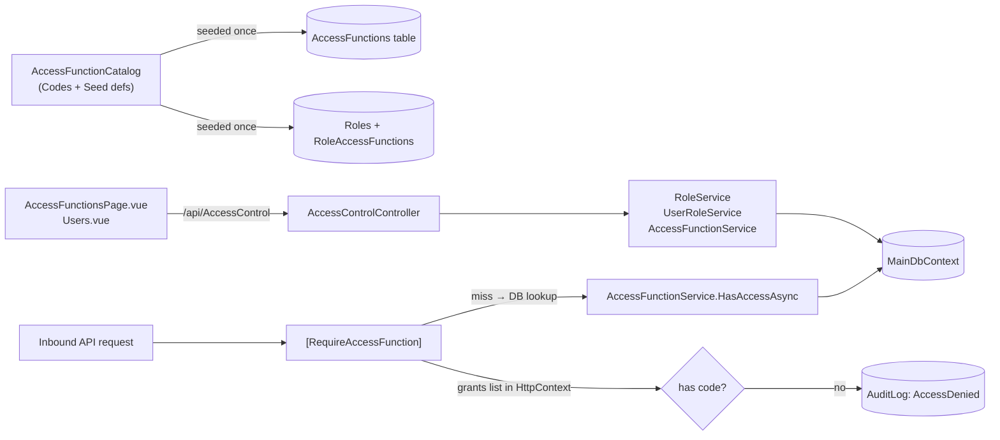

# Authorization — Access Functions

> **Status:** `core`
> **Removable in derived repos:** **no** — the entire authorization model rests on this
> **Required by:** every controller that uses `[RequireAccessFunction]`, every protected sidebar item, the Access Control admin UI, the FE permission composable

The template's authorization model is **explicit, code-driven access functions** — **not** controller/action discovery, **not** role-permission lookup tables. Every protected operation has a string code (e.g. `api.audit-log.read` or `screen.access-control.view`) that is registered in the central `AccessFunctionCatalog`, seeded into the `AccessFunctions` table, granted to roles via the `RoleAccessFunctions` join table, and evaluated at request time by the `[RequireAccessFunction("...")]` filter attribute.

There are exactly two kinds of access function:

- `EAccessFunctionType.Screen` — guards a Vue route ("can this user see the Audit page?"). Evaluated FE-side via `usePermissions`.
- `EAccessFunctionType.Api` — guards a controller method. Evaluated server-side via `RequireAccessFunctionAttribute.OnAuthorizationAsync`.

Roles map users to bundles of access functions through `Role` ↔ `RoleAccessFunction` ↔ `AccessFunction` and `User` ↔ `UserRole` ↔ `Role`. There is no `RolePermission` table, no claim-based authorization, no controller-action reflection. `IAccessFunctionService.HasAccessAsync(userId, code)` is the only authorization predicate in the system.

## Quick links

- [`files.md`](./files.md) — every file owned and touched by this feature
- [`do-dont.md`](./do-dont.md) — feature-specific rules (no RolePermission tables, no controller-action discovery)
- [`customize.md`](./customize.md) — adding a new access function, role, or screen guard
- [`verify.md`](./verify.md) — proof end-to-end authorization works

## Architectural shape

## Key entry points

| Layer | Path | Purpose |
| --- | --- | --- |
| Filter attribute | `src/backend/API/Authorization/RequireAccessFunctionAttribute.cs` | The single authorization gate; reads `HttpContext.Items[Constants.KeySessionUserAccessFunctions]` first, falls back to `IAccessFunctionService.HasAccessAsync`, audits denials |
| Catalog | `src/backend/Libraries/Domain/Security/AccessFunctionCatalog.cs` | `AccessFunctionCodes.Screen.*` and `AccessFunctionCodes.Api.*` constants + seed definitions for `AccessFunctions` table + role bundles |
| Service | `src/backend/Libraries/Services/Services/AccessFunction/AccessFunctionService.cs` | `GetAllAsync`, `GetUserAccessFunctionCodesAsync` (Valkey-cached), `HasAccessAsync` |
| Admin controller | `src/backend/API/Controllers/AccessControlController.cs` | `GetOverview`, `GetCurrentAccessProfile`, `CreateRole`, `UpdateRole`, `DeleteRole`, `AssignRole`, `RemoveAssignment`, `UpdateRoleAccessFunctions` |
| Role service | `src/backend/Libraries/Services/Services/Role/RoleService.cs` | CRUD over `Role` + cascading `RoleAccessFunction` rows |
| User-role service | `src/backend/Libraries/Services/Services/Role/UserRoleService.cs` | Assigns/removes `UserRole` rows, returns `AccessControlUsersAsync` snapshot |
| User-roles middleware | `src/backend/API/Middleware/UserRolesMiddleware.cs` | Hydrates `KeySessionUserAccessFunctions` once per request after session validation |
| Access function entity | `src/backend/Libraries/Domain/Models/AccessFunction.cs` | `Code`, `Name`, `Module`, `Type` (`EAccessFunctionType`), `ResourceName`, `Route`, `HttpMethod`, `IsActive` |
| Role entity | `src/backend/Libraries/Domain/Models/Role.cs` | `Code`, `Name`, `Description`, `IsActive`, nav `RoleAccessFunctions` |
| Join entities | `src/backend/Libraries/Domain/Models/RoleAccessFunction.cs`, `UserRole.cs` | M-to-M links — RoleAccessFunction has the FK pair (RoleId, AccessFunctionId); UserRole has UserId + RoleId + IsActive + ExpiresOn |
| FE admin UI | `src/frontend/main/src/staff/pages/admin/AccessFunctionsPage.vue` | Browse + edit access functions and their role mapping |
| FE admin UI | `src/frontend/main/src/staff/pages/admin/Users.vue` | Assign roles to users |
| FE permission composable | `src/frontend/main/src/composables/usePermissions.ts` | Reactive `userAccessFunctionCodes`, `hasAccessFunction(code)`, `navItems` |
