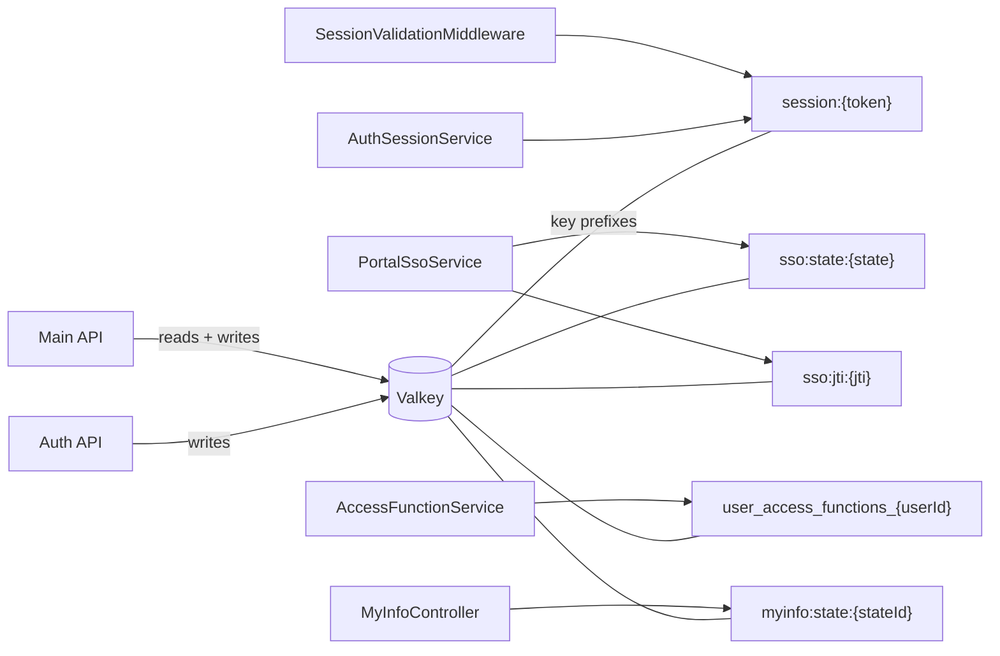

# Caching — Valkey

> **Status:** `core`
> **Removable in derived repos:** **no** — sessions and access-function caching depend on it
> **Required by:** `authentication` (session store), `authorization-access-functions` (`user_access_functions_{userId}`), `singpass-myinfo` (state), Portal SSO (state + replay)

Valkey is the project's distributed cache (open-source Redis-API drop-in). Both the Auth API and the Main API connect to the same Valkey instance and share keys across processes.

The Auth API uses Valkey for:

- `session:{token}` — the canonical session payload
- `sso:state:{state}` — Portal SSO state machine record
- `sso:jti:{jti}` — Portal SSO replay protection

The Main API uses Valkey for:

- Reading `session:{token}` (via `SessionValidationMiddleware`)
- `user_access_functions_{userId}` — granted access function codes per user (in `AccessFunctionService`)
- `myinfo:state:{stateId}` — Singpass MyInfo state record

The wiring is identical in both apps: register `IConnectionMultiplexer` (a singleton) and `AddStackExchangeRedisCache` (the `IDistributedCache` provider). Connection settings come from `Valkey:ConnectionString` and an optional `Valkey:InstanceName` prefix.

## Quick links

- [`files.md`](./files.md) — every file owned and touched by this feature
- [`do-dont.md`](./do-dont.md) — feature-specific rules
- [`customize.md`](./customize.md) — switching connection mode, setting eviction policy, key naming
- [`verify.md`](./verify.md) — reachability + key inspection

## Architectural shape

## Key entry points

| Layer | Path | Purpose |
| --- | --- | --- |
| Main API multiplexer | `src/backend/API/Program.cs` lines 53-58 | `builder.Services.AddSingleton<IConnectionMultiplexer>(...)` from `Valkey:ConnectionString` |
| Main API distributed cache | `src/backend/API/Program.cs` lines 61-71 | `builder.Services.AddStackExchangeRedisCache(...)` with `AbortOnConnectFail = false` |
| Auth multiplexer | `src/backend/Auth/Program.cs` lines 47-52 | Same singleton registration in the Auth process |
| Auth distributed cache | `src/backend/Auth/Program.cs` lines 54-64 | Same `AddStackExchangeRedisCache` with optional `InstanceName` prefix |
| Health probe | `src/backend/API/Program.cs` line 76 | `services.AddHealthChecks().AddRedis(connectionString, name: "valkey")` |
| Config | `src/backend/API/appsettings.json` `Valkey:ConnectionString`, `Valkey:InstanceName` | Connection settings; default in dev points at `localhost:6379` |
| Skip path | `SessionValidationMiddleware.cs` line 99 | `/health` is in skip list so probes can hit the Valkey health check without a session |
