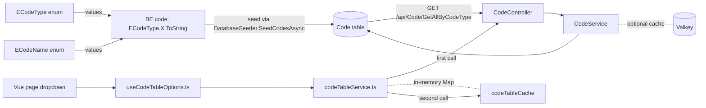

# Code Tables

> **Status:** `core`
> **Removable in derived repos:** **no** — every project uses code tables for dropdowns, status enums, lookup lists
> **Required by:** any service that resolves a string to a friendly label, any FE dropdown, the procurement sample, the seeded role / access function display data

`Code` is the universal lookup-list entity. Every dropdown value, every category, every unit-of-measure, every currency, every system enumeration that needs a `DisplayName` lives in this single table. The shape is intentionally minimal:

- `Type` (string from `ECodeType`) — the lookup family ("VENDOR_CATEGORY", "CURRENCY", ...)
- `Name` (string from `ECodeName`) — the canonical machine-readable value ("IT_SERVICES", "SGD", ...)
- `DisplayName` — the human-readable label ("IT Services", "Singapore Dollar")
- `Description`, `DisplayOrder`, `IsActive`

The two enums `ECodeType` and `ECodeName` are the **only** allowed source for the `Type` and `Name` strings anywhere in the codebase. The rule "never hardcode a code type or name string" is enforced by convention; AI agents and human developers must always reference `ECodeType.X.ToString()` and `ECodeName.Y.ToString()`.

The FE caches code tables per-type in-memory (`codeTableCache` Map), with deduplication of in-flight requests (`pendingRequests` Map). Calling `getByType(ECodeType.X.ToString())` is cheap after the first call.

## Quick links

- [`files.md`](./files.md) — every file owned and touched by this feature
- [`do-dont.md`](./do-dont.md) — feature-specific rules (NEVER hardcode strings)
- [`customize.md`](./customize.md) — adding a new code type, seeding rows, refreshing the FE cache
- [`verify.md`](./verify.md) — proof the lookup is consistent BE↔FE

## Architectural shape

## Key entry points

| Layer | Path | Purpose |
| --- | --- | --- |
| Entity | `src/backend/Libraries/Domain/Models/Code.cs` | Five-column lookup row |
| Type enum | `src/backend/Libraries/Domain/Enum/ECodeType.cs` | `TITLE`, `USER_TYPE`, `VENDOR_CATEGORY`, `CATALOG_CATEGORY`, `UNIT_OF_MEASURE`, `DELIVERY_LOCATION`, `CURRENCY` (extend per project) |
| Name enum | `src/backend/Libraries/Domain/Enum/ECodeName.cs` | All canonical names grouped by their `Type` (with comments delimiting each group) |
| Service interface | `src/backend/Libraries/Services/Services/Code/ICodeService.cs` | `GetAllByCodeTypeAsync(string codeType)`, CRUD for admin scenarios |
| Service impl | `src/backend/Libraries/Services/Services/Code/CodeService.cs` | EF Core implementation; filters by `Type` and `IsActive`, orders by `DisplayOrder` |
| Controller | `src/backend/API/Controllers/CodeController.cs` | `GetAllByCodeType` (gated by `AccessFunctionCodes.Api.CodeRead`), CRUD |
| Seeder | `src/backend/API/Extensions/DatabaseSeeder.cs` (`SeedCodesAsync`) | Seeds rows from a static dictionary keyed off `ECodeType` / `ECodeName` |
| FE service | `src/frontend/main/src/services/codeTableService.ts` | `getByType(type, forceRefresh)` with two-Map cache (results + in-flight promises) |
| FE composable | `src/frontend/main/src/composables/useCodeTableOptions.ts` | Reactive `codeTableOptions` keyed by type, parallel-loads via `Promise.allSettled` |
| FE constants | `src/frontend/main/src/services/codeTableService.ts` `CodeTableType` const object | Mirror of `ECodeType` for FE imports |
