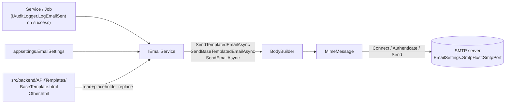

# Email Notifications

> **Status:** `core`
> **Removable in derived repos:** **no** — virtually every workflow has at least one transactional email
> **Required by:** any service that sends email — approval emails, password reset (if implemented), notification fan-out

The email feature is a thin SMTP-based service backed by MailKit. It exposes a single `IEmailService` with overloads for:

- **Templated email** — load an HTML template from `src/backend/API/Templates/`, replace `{Placeholder}` tokens, send.
- **Base-templated email** — wrap arbitrary content HTML inside the shared `BaseTemplate.html` (NIE-branded header / footer / date / year), send.
- **Raw email** — send a pre-built HTML body to one or more `To`s, with optional `Cc` and a configured `Bcc` list.

The service derives a sensible `SenderEmail` from `EmailSettings.AppName` (`"i3g" → i3g@nie.edu.sg`) so every NIE app gets consistent sender addresses without per-deploy config noise. It supports STARTTLS via `EnableSsl` and SMTP auth via `SmtpUsername` / `SmtpPassword`.

The service does NOT manage:

- Queues / retries (use `tickerq-background-jobs` for retryable workflows)
- Click tracking (out of scope; if needed, integrate Mailgun / SES)
- Push notifications (see `push-notifications-onesignal`)

## Quick links

- [`files.md`](./files.md) — every file owned and touched by this feature
- [`do-dont.md`](./do-dont.md) — feature-specific rules
- [`customize.md`](./customize.md) — adding templates, swapping providers, batching
- [`verify.md`](./verify.md) — local SMTP smoke (Mailpit / mailhog)

## Architectural shape

## Key entry points

| Layer | Path | Purpose |
| --- | --- | --- |
| Interface | `src/backend/Libraries/Shared/Interfaces/IEmailService.cs` | The contract: `SendEmailAsync`, `SendEmailWithCCAsync`, `SendTemplatedEmailAsync`, `SendBaseTemplatedEmailAsync` (with single + list overloads) |
| Service | `src/backend/Libraries/Services/Services/EmailService.cs` | MailKit-based implementation. Loads templates from `{ContentRoot}/Templates/`, replaces `{Placeholder}` tokens, BCCs every message per `EmailSettings.BccEmails`, derives sender from `AppName` if not set |
| Settings | `src/backend/Libraries/Shared/Models/EmailSettings.cs` | `AppName`, `SmtpHost`, `SmtpPort`, `SmtpUsername`, `SmtpPassword`, `SenderEmail`, `SenderName`, `EnableSsl`, `BccEmails` |
| Base template | `src/backend/API/Templates/BaseTemplate.html` | NIE-branded shell with `{AppName}`, `{Content}`, `{DateTime}`, `{Year}` placeholders |
| Per-template files | `src/backend/API/Templates/*.html` | Individual templates (e.g. `ApprovalRequest.html`, `PasswordReset.html` if added by the project) |
| DI registration | `src/backend/API/Program.cs` lines 96-103 | `Configure<EmailSettings>` + scoped `IEmailService` factory that injects `ContentRootPath` |
