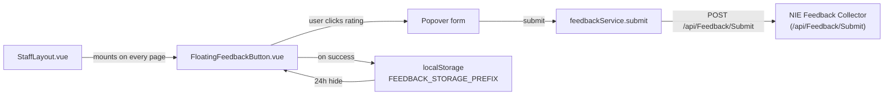

# Feedback Widget

> **Status:** `core`
> **Removable in derived repos:** **no** — part of the org-wide tech roadmap; every NIE staff app must surface the feedback button
> **Required by:** the staff layout in every page (`StaffLayout.vue`) — every authenticated screen renders the floating button

The feedback widget is a thumbs-up / thumbs-down popover anchored at the bottom-right of every authenticated staff page. The user picks a rating (`1` for negative, `5` for positive), optionally writes free-text feedback, and submits to a central NIE feedback collection endpoint via `POST /api/Feedback/Submit`. Each submission carries a `function_id` (per-page identifier) so the receiver can aggregate by feature, the literal `rating`, the feedback text, and the current `window.location.href` for context.

After a submission, the widget hides itself for 24 hours per `function_id` via `localStorage` to avoid pestering. The widget is mounted inside the global `StaffLayout.vue` so all authenticated pages get it for free; pages do not need to import it.

There is a known issue (template task `0003`): the `function_id` is currently derived as `procurement.${routeName}` because the layout still carries the procurement-sample naming. Derived projects should namespace this to their own project slug.

## Quick links

- [`files.md`](./files.md) — every file owned and touched by this feature
- [`do-dont.md`](./do-dont.md) — feature-specific rules
- [`customize.md`](./customize.md) — change placement, namespace, behavior
- [`verify.md`](./verify.md) — manual click-path verification

## Architectural shape

## Key entry points

| Layer | Path | Purpose |
| --- | --- | --- |
| Page-level button | `src/frontend/main/src/components/feedback/FloatingFeedbackButton.vue` | The visible widget — handles popover state, rating selection, 24-hour hide via `localStorage`, toast on success, error handling |
| Composite UI | `src/frontend/packages/ui/src/components/composite/app-feedback/NieAppFeedbackHub.vue` | The lower-level visual primitive (rating buttons + textarea + submit), reused by `FloatingFeedbackButton` |
| FE service | `src/frontend/main/src/services/feedbackService.ts` | The typed axios client. Defines `FeedbackSubmitRequest` (`function_id`, `rating: "1" \| "5"`, `feedback`, `page`) and posts to `/api/Feedback/Submit` |
| Layout mount | `src/frontend/main/src/staff/layouts/StaffLayout.vue` (lines 12, 67-69, ~1034) | Imports `FloatingFeedbackButton`, computes `feedbackFunctionId`, renders `<FloatingFeedbackButton :function-id="feedbackFunctionId" />` once near the layout's bottom |
| 24-hour storage | `localStorage` keys `procurement.feedback.submittedAt.<functionId>` | TTL constant `FEEDBACK_HIDE_TTL_MS = 24 * 60 * 60 * 1000` defined in `FloatingFeedbackButton.vue` |
| Backend endpoint | (External NIE service) `POST /api/Feedback/Submit` | The receiver lives in a separate service; this template proxies the request through its own `/api/Feedback/Submit` route. The `feedbackService.submit` call hits the local Main API which forwards. |
