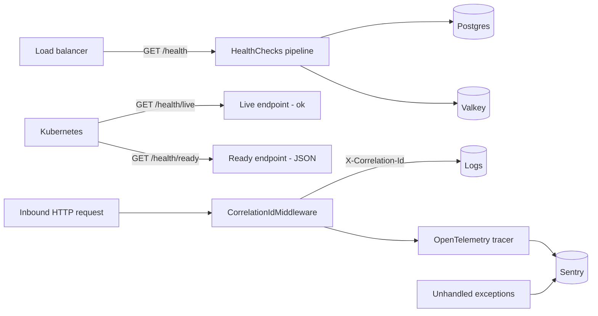

# Health Checks & Observability

> **Status:** `core`
> **Removable in derived repos:** **no** — every NIE deployment requires the `/health` endpoints for ALB/uptime checks; Sentry+OTel is the org-wide observability standard
> **Required by:** load balancer / Kubernetes probes / uptime monitor / Sentry dashboards

The feature ships three orthogonal concerns:

1. **Three health endpoints**
   - `GET /health` — full health-check pipeline (Postgres + Valkey via the standard ASP.NET HealthChecks builder). 200 when both deps are reachable.
   - `GET /health/ready` — JSON body returning `{ status: "healthy", service, timestamp }`. Lightweight, used by load balancers to gate "this instance is ready to receive traffic".
   - `GET /health/live` — flat `"ok"` string. Used by Kubernetes liveness probes; returning 200 just confirms the process is alive (does NOT exercise dependencies).

2. **Sentry + OpenTelemetry** — `ObservabilityExtensions.AddObservability` wires Sentry's ASP.NET Core integration with OTel ASP.NET, HttpClient, and EF Core instrumentations. Activates only when `Sentry:Dsn` is set; otherwise the call is a no-op so dev environments are quiet.

3. **Correlation ID middleware** — every request gets a correlation ID inserted as `X-Correlation-Id` (header + log scope). The audit log captures this in `AuditLog.CorrelationId`.

The Auth API runs the same Sentry+OTel stack via `Auth/Program.cs:19-42` (mirror of the Main API setup).

## Quick links

- [`files.md`](./files.md) — every file owned and touched by this feature
- [`do-dont.md`](./do-dont.md) — feature-specific rules
- [`customize.md`](./customize.md) — adding health checks, raising sample rate, custom OTel exporters
- [`verify.md`](./verify.md) — endpoint smoke + Sentry capture

## Architectural shape

## Key entry points

| Layer | Path | Purpose |
| --- | --- | --- |
| Boot extension | `src/backend/API/Extensions/ObservabilityExtensions.cs` | `builder.AddObservability()` — registers Sentry SDK + OTel tracing for ASP.NET Core, HttpClient, EF Core |
| Health pipeline | `src/backend/API/Program.cs` lines 74-76 | `services.AddHealthChecks().AddNpgSql(...).AddRedis(...)` |
| Health endpoints | `src/backend/API/Program.cs` lines 240-247 | `MapHealthChecks("/health")`, `MapGet("/health/ready", ...)`, `MapGet("/health/live", ...)` |
| Correlation ID | `src/backend/API/Middleware/CorrelationIdMiddleware.cs` | First middleware in the pipeline; reads / generates `X-Correlation-Id` |
| Auth-side observability | `src/backend/Auth/Program.cs` lines 19-42 | Mirror Sentry+OTel setup so Auth traces are captured too |
| Skip path | `src/backend/API/Middleware/SessionValidationMiddleware.cs` line 99 | `/health` is in `skipPaths` so probes never need a session |
| Config | `src/backend/API/appsettings.json` `Sentry:*` | `Dsn`, `Environment`, `TracesSampleRate`, `ServiceName` |
