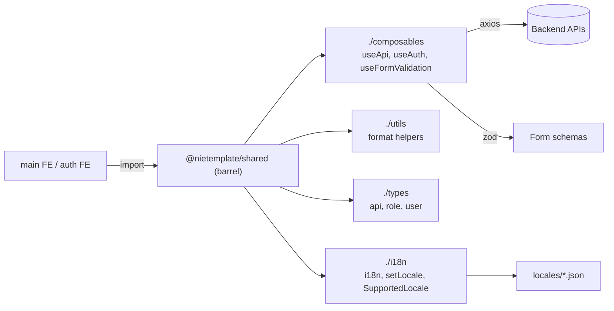

# Shared Utilities — `@nietemplate/shared`

> **Status:** `core`
> **Removable in derived repos:** **no** — both FE apps depend on it for types, i18n, and base composables
> **Required by:** `src/frontend/main`, `src/frontend/auth`, `@nietemplate/ui` (peer)

`@nietemplate/shared` is the second internal Vue 3 workspace package. Where `@nietemplate/ui` ships visible components, `@nietemplate/shared` ships the **non-visual cross-app primitives** — types, composables, utility functions, and the i18n bundle — that both the main staff app and the auth app need.

The package has five subpath exports:

- `./composables` — `useApi`, `useAuth`, `useFormValidation`
- `./utils` — `format` helpers (currency, date, number formatting beyond what `@nietemplate/ui` ships)
- `./types` — TypeScript shapes for `api`, `role`, `user`
- `./i18n` — Vue I18n bundle with `i18n` instance, `setLocale`, `SupportedLocale` type, and `locales/` JSON
- `./components` — currently a barrel-only stub for future shared components (no .vue files yet)

The split between `ui` and `shared` is deliberate:

- `@nietemplate/ui` = visual / Tailwind / Vue components.
- `@nietemplate/shared` = TS types + composables + i18n + axios + zod + vue-router. No styles, no .vue files.

## Quick links

- [`files.md`](./files.md) — every file owned and touched by this feature
- [`do-dont.md`](./do-dont.md) — feature-specific rules
- [`customize.md`](./customize.md) — adding types, locales, composables
- [`verify.md`](./verify.md) — type check + locale switching

## Architectural shape

## Key entry points

| Layer | Path | Purpose |
| --- | --- | --- |
| Manifest | `src/frontend/packages/shared/package.json` | `private: true`, source-only export, five subpath exports (`.`, `./components`, `./composables`, `./utils`, `./types`, `./i18n`) |
| Barrel | `src/frontend/packages/shared/src/index.ts` | Re-exports all subpaths |
| Composables | `src/frontend/packages/shared/src/composables/{useApi,useAuth,useFormValidation}.ts` | API helper, auth state primitive, zod-backed form validator |
| Utilities | `src/frontend/packages/shared/src/utils/format.ts` | Currency / date / number formatters (locale-aware) |
| Types | `src/frontend/packages/shared/src/types/{api,role,user}.ts` | API envelope, Role, User shapes |
| i18n | `src/frontend/packages/shared/src/i18n/index.ts` + `locales/` | Vue I18n setup + locale JSON files |
| Components stub | `src/frontend/packages/shared/src/components/index.ts` | Empty barrel reserved for future cross-app .vue components |
