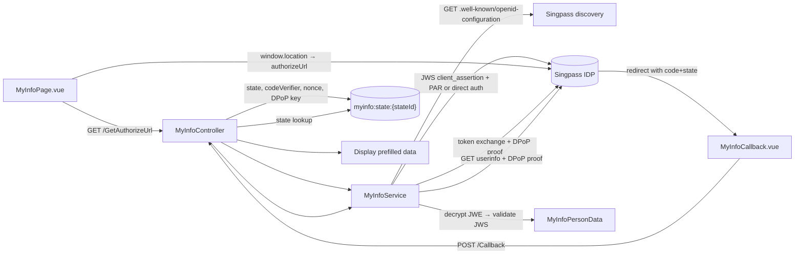

# Singpass MyInfo

> **Status:** `optional-core`
> **Removable in derived repos:** **yes** — projects that don't onboard Singapore citizens can remove this feature via a future task (similar shape to task 0003)
> **Required by:** any staff page that prefills personal data from MyInfo (`MyInfoPage.vue`); nothing in the rest of the template hard-depends on it

The MyInfo feature implements OAuth2 + OIDC against Singapore's Singpass identity provider with full **FAPI** compliance (Pushed Authorization Request, DPoP-bound access tokens, JWE-encrypted ID + UserInfo tokens, JWS client assertion). The flow is split into:

- `GET /api/MyInfo/GetAuthorizeUrl` — server creates the PKCE pair, the DPoP key, the nonce, and either signs a JWS client assertion + posts a PAR, or builds a direct authorize URL (depending on the discovery doc). State, code verifier, nonce, and DPoP private key are stashed in Valkey under `myinfo:state:{stateId}` for 10 minutes.
- The browser navigates to the returned `authorizeUrl`. Singpass authenticates the citizen, then redirects back to the configured `MyInfo:RedirectUri` carrying `?code=...&state=...`.
- `POST /api/MyInfo/Callback` — Main API exchanges the auth code for tokens, validates the encrypted ID token, fetches and validates the UserInfo JWE, and returns a flat `MyInfoPersonData` DTO (name, NRIC/FIN, sex, race, nationality, DOB, address, employment, etc.) to the FE.

Crypto is loaded from a single private JWKS file (`src/backend/API/MyInfo/Jwks/private-jwks.json`) — one EC key for signing client assertions, one EC key for decrypting JWEs. The discovery document is cached in `IMemoryCache` for 1 hour; the issuer signing keys for 1 hour; client keys for 15 minutes. All cache is in-process.

## Quick links

- [`files.md`](./files.md) — every file owned and touched by this feature
- [`do-dont.md`](./do-dont.md) — feature-specific rules
- [`customize.md`](./customize.md) — onboarding to a different MyInfo environment, swapping keys, narrowing scopes
- [`verify.md`](./verify.md) — proof the flow boots without real credentials (no real Singpass tokens here)

## Architectural shape

## Key entry points

| Layer | Path | Purpose |
| --- | --- | --- |
| Controller | `src/backend/API/Controllers/MyInfoController.cs` | `GetAuthorizeUrl`, `Callback`, `IsConfigured`. Owns state lifecycle (10-minute TTL) in Valkey under `myinfo:state:` |
| Service | `src/backend/Libraries/Services/Services/MyInfo/MyInfoService.cs` | All crypto: JWS client assertion, DPoP proof creation, JWE decryption (library + manual ECDH-ES fallback), UserInfo parsing |
| Service interface | `src/backend/Libraries/Services/Services/MyInfo/IMyInfoService.cs` | `IsConfigured`, `CreateAuthorizationRequestAsync`, `GetPersonDataAsync` |
| Client JWKS | `src/backend/API/MyInfo/Jwks/private-jwks.json` | The two private EC keys (signing + encryption) — do NOT commit a real production key here |
| FE start page | `src/frontend/main/src/staff/pages/staff/MyInfoPage.vue` | Initiates the flow + renders the returned person data |
| FE callback page | `src/frontend/main/src/staff/pages/staff/MyInfoCallback.vue` | Exchanges `?code=&state=` against `/Callback` and stores result in Pinia / page state |
| FE service | `src/frontend/main/src/services/myInfoService.ts` | API client wrapping the two endpoints |
| Config | `src/backend/API/appsettings.json` `MyInfo` section | `ClientId`, `RedirectUri`, `DiscoveryUrl` (or `BaseUrl`), `Scopes` / `Attributes`, `JwtClientAuthentication.PrivateJwksPath`, `JwtClientAuthentication.SigningKeyId`, `JwtClientAuthentication.EncryptionKeyId` |
