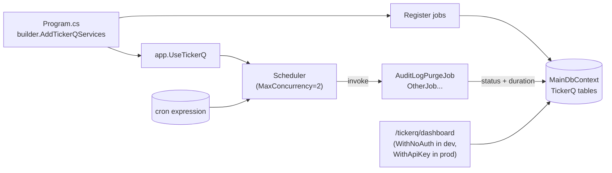

# TickerQ Background Jobs

> **Status:** `core`
> **Removable in derived repos:** **no** — at minimum `audit-logging` depends on the purge job
> **Required by:** `audit-logging` (purge job), any future scheduled work

TickerQ is the .NET background job framework chosen for the template. It uses the same PostgreSQL database (via `MainDbContext`) for its operational store, runs in-process inside the Main API, and exposes a web dashboard at `/tickerq/dashboard`. Jobs are declared as plain classes whose methods are decorated with `[TickerFunction("Name", cronExpression: "...")]`. The TickerQ host scans the registered classes on boot, persists schedule rows, and dispatches the methods on the cron timetable while respecting `MaxConcurrency` and `IdleWorkerTimeOut` settings.

The single shipped job is `AuditLogPurgeJob`. Derived projects add their own jobs by registering the class in `TickerQExtensions.AddTickerQServices` and decorating the executor method.

## Quick links

- [`files.md`](./files.md) — every file owned and touched by this feature
- [`do-dont.md`](./do-dont.md) — feature-specific rules
- [`customize.md`](./customize.md) — adding jobs, changing schedules, securing the dashboard
- [`verify.md`](./verify.md) — proof the scheduler runs and the dashboard is reachable

## Architectural shape

## Key entry points

| Layer | Path | Purpose |
| --- | --- | --- |
| Boot extension | `src/backend/API/Extensions/TickerQExtensions.cs` | `AddTickerQServices` (DI + scheduler config + EF operational store + dashboard) and `UseTickerQServices` (pipeline registration) |
| Bootstrap call | `src/backend/API/Program.cs` (line 159, 250) | `AddTickerQServices(configuration, builder.Environment)` then `app.UseTickerQServices()` BEFORE `UseSessionValidation` so the dashboard skips session auth |
| Skip path | `src/backend/API/Middleware/SessionValidationMiddleware.cs` (line 100) | The `/tickerq` prefix is in `skipPaths` so the dashboard is never gated by session validation |
| First job | `src/backend/API/Jobs/AuditLogPurgeJob.cs` | Daily `0 0 2 * * *` purge of audit rows older than `AuditLogSettings.RetentionMonths` |
| Job settings | `src/backend/API/Jobs/AuditLogPurgeJob.cs` (`AuditLogSettings` POCO) | `RetentionMonths` and `BatchSize` config keys under `AuditLog` section |
| Dashboard | `http://localhost:5002/tickerq/dashboard` | Shipped UI for inspecting / triggering / pausing jobs |
| Scheduler timezone | `src/backend/Libraries/Shared/Helpers/DateTimeHelper.cs` (`SingaporeTimeZone`) | Cron expressions evaluate against Singapore wall-clock |
