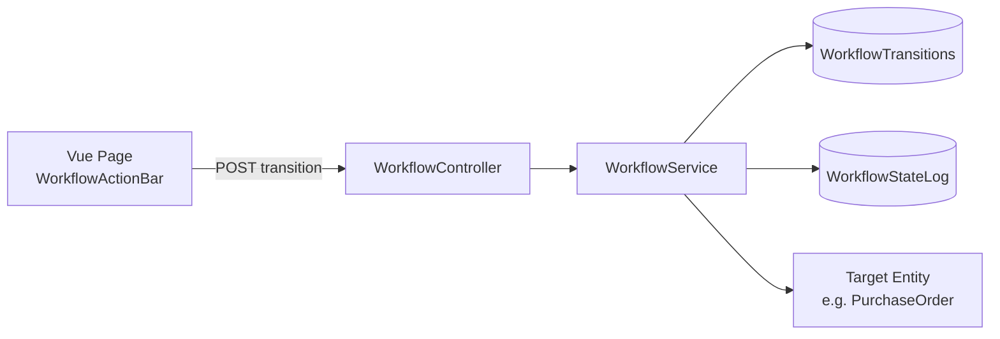

# Workflow Engine

> **Status:** `core`
> **Removable in derived repos:** **no** — state machines are foundational
> **Source:** Extracted from isaac-adm `WorkflowService` / `WorkflowTransition` pattern

## Overview

The Workflow Engine provides a table-driven state machine for any entity that needs approval flows, status tracking, or compliance audit trails. Transitions are stored in `WorkflowTransitions` — no code changes needed to add new states or modify the flow.

## Architecture

## Key Files

| Layer        | Path                                        | Purpose                                                                   |
| ------------ | ------------------------------------------- | ------------------------------------------------------------------------- |
| Enum         | `Domain/Enum/EWorkflowState.cs`             | Standard states: Draft→Submitted→UnderReview→Approved/Rejected→Completed  |
| Entity       | `Domain/Models/WorkflowTransition.cs`       | Configurable transitions (FromState, ToState, RequiredRole, DisplayLabel) |
| Entity       | `Domain/Models/WorkflowStateLog.cs`         | Audit trail (polymorphic OwnerType+OwnerId)                               |
| Service      | `Services/Workflow/IWorkflowService.cs`     | Interface: GetCurrentState, TransitionState, GetAvailableTransitions      |
| Service      | `Services/Workflow/WorkflowService.cs`      | Implementation with role-based validation                                 |
| Controller   | `API/Controllers/WorkflowController.cs`     | REST endpoints for state operations                                       |
| FE Component | `components/workflow/WorkflowTimeline.vue`  | Vertical timeline showing state history                                   |
| FE Component | `components/workflow/WorkflowActionBar.vue` | Action buttons with remarks dialog                                        |
| FE Service   | `services/workflowService.ts`               | API client                                                                |

## Usage (Procurement Example)

1. PurchaseOrder starts in `Draft` state
2. User clicks "Submit for Review" → transitions to `Submitted`
3. Manager clicks "Start Review" → transitions to `UnderReview`
4. Manager clicks "Approve" → transitions to `Approved`
5. User clicks "Mark as Completed" → transitions to `Completed`
