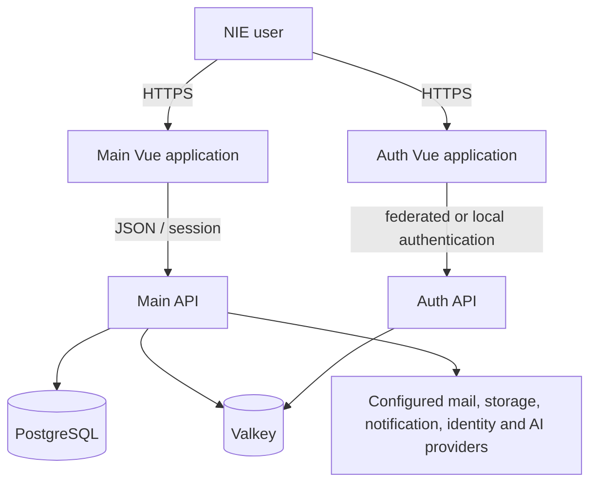
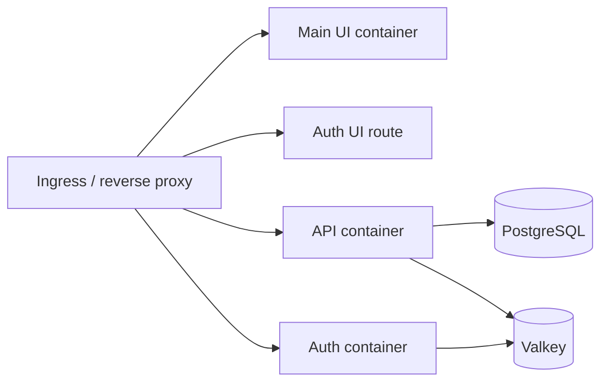

# Architecture

This is the source of truth for the reference application's code boundaries. Product identity is configuration; it is not encoded into shared folder names, assemblies, namespaces, or workspace package names.

## Stable source identity

The following names are deliberately generic and must remain stable in the template and derived applications:

- .NET solution and projects: `Backend.sln`, `Api`, `Auth`, `Application`, `Domain`, `Persistence`, `AI`, `BuildingBlocks`, and `Validation`;
- .NET namespaces: the project name followed by the feature or technical area, such as `Application.Features.AuditLog` or `Infrastructure.Persistence`;
- Vue workspace locations: `apps/main`, `apps/auth`, `packages/contracts`, `packages/platform`, and `packages/ui`;
- Vue package scope: `@nie/contracts`, `@nie/platform`, and `@nie/ui`.

An application name belongs in typed runtime configuration, branding, catalog metadata, deployment values, observability resource attributes, and externally visible artifact labels. Do not perform a repository-wide namespace or folder rename when scaffolding a product. This keeps canonical source updates reviewable and reduces merge conflicts.

## Repository layout

```text
src/
|-- backend/
|   |-- Hosts/
|   |   |-- Api/                    # Main HTTP composition root
|   |   `-- Auth/                   # Authentication HTTP composition root
|   |-- Core/
|   |   |-- Domain/                 # Entities, value types, enums, domain contracts
|   |   `-- Application/            # Use cases, DTO contracts, provider ports
|   |-- Infrastructure/
|   |   |-- Persistence/            # EF Core, migrations, external provider adapters
|   |   `-- AI/                     # AI/RAG provider adapters and vector persistence
|   |-- BuildingBlocks/
|   |   |-- BuildingBlocks/         # Small dependency-free technical helpers
|   |   `-- Validation/             # FluentValidation HTTP integration
|   `-- Tests/                       # Architecture and focused unit tests
`-- frontend/
    |-- apps/
    |   |-- main/                    # Product shell and business features
    |   `-- auth/                    # Authentication user experience
    `-- packages/
        |-- contracts/               # Dependency-free TypeScript contracts
        |-- platform/                # Non-visual browser/runtime capabilities
        `-- ui/                      # Visual, accessible Vue design system
```

Within an application project, organize business code by feature. A feature owns its request/response contracts, use cases, validation, UI composition, tests, and persistence mapping where practical. Technical folders are acceptable only at true framework boundaries, such as middleware, migrations, or composition.

## Source organization at scale

Use feature-first folders, followed by responsibility only where the feature needs it. Do not allow a project-wide `Services`, `Models`, `Controllers`, `Composables`, or `Tests` directory to grow as an unbounded flat catalogue.

```text
Core/Application/Integration/
|-- Contracts/
|-- Grpc/
|-- Messaging/
|   |-- Dispatching/
|   |-- Handlers/
|   |-- Persistence/
|   |-- Processing/
|   |-- Publishing/
|   `-- Transport/
`-- Validation/

apps/main/src/
|-- services/
|   |-- access-control/
|   |-- notifications/
|   |-- procurement/
|   `-- reports/
|-- composables/
|   |-- data-tables/
|   |-- reports/
|   `-- shell/
`-- staff/pages/
    |-- admin/
    |-- myinfo/
    `-- procurement/
```

A non-generated source directory is limited to ten direct `.cs`, `.ts`, or `.vue` files. When it approaches the limit, split by cohesive feature or responsibility rather than by arbitrary alphabetical buckets. EF migrations, generated output, project files, tool configuration, and genuine app/project composition roots may be explicit exceptions. Every source exception must be an exact repository-relative allowlisted root in the architecture test; a conveniently named `Generated` or `Migrations` folder is not exempt. Keep namespaces, public type identities, configured aliases, and package exports stable unless a separate approved API change requires otherwise.

`SourceFolderCohesionTests` enforces the bounded-folder rule across backend and frontend source. This is a guardrail against flat growth, not a target: small cohesive areas should remain small instead of acquiring speculative folders.

## Dependency direction

```mermaid
flowchart LR
    Api[Hosts / Api] --> Application[Core / Application]
    Api --> Persistence[Infrastructure / Persistence]
    Api --> AI[Infrastructure / AI]
    Api --> Validation[BuildingBlocks / Validation]
    Api --> Blocks[BuildingBlocks]
    Auth[Hosts / Auth] --> Validation
    Auth --> Blocks
    Persistence --> Application
    Persistence --> Domain[Core / Domain]
    Persistence --> Blocks
    AI --> Application
    AI --> Domain
    AI --> Blocks
    Application --> Domain
    Application --> Blocks

    Main[apps / main] --> UI[@nie/ui]
    Main --> Platform[@nie/platform]
    AuthUI[apps / auth] --> UI
    AuthUI --> Platform
    Platform --> Contracts[@nie/contracts]
```

The dependency rules are:

1. `Domain` has no project dependencies and contains no HTTP, EF provider, storage, mail, AI-provider, or UI types.
2. `Application` owns use cases and the interfaces required from infrastructure. It must not reference `Persistence`, `AI`, or either host.
3. Infrastructure implements application-owned ports. Provider SDK types stay inside infrastructure adapters.
4. Hosts are composition roots. They select adapters, configure middleware, and expose thin endpoints; they do not own business rules.
5. `BuildingBlocks` is dependency-free and domain-neutral. `Validation` is a focused HTTP integration around FluentValidation.
6. `@nie/contracts` has no runtime dependency. `@nie/platform` is non-visual. `@nie/ui` is visual and domain-neutral. Application workflows remain in an app.

Architecture tests enforce the critical .NET dependency direction and repository source layout under `src/backend/Tests/Architecture.Tests/Layers/` and `src/backend/Tests/Architecture.Tests/SourceLayout/`. Frontend package manifests, isolated type checks, and consumer builds provide the equivalent package-boundary evidence.

## System context



Provider integrations are optional and configuration-driven. Each vendor-specific adapter must implement an application-owned or open ecosystem abstraction and retain a credible alternative and exit plan.

## Runtime and data constraints

- Application-managed relational keys are RFC 9562 UUIDv7 values mapped to PostgreSQL `uuid`.
- EF Core migrations belong only to `Infrastructure/Persistence`.
- Externally supplied HTTP models are validated with FluentValidation and returned as RFC 7807 validation problems.
- Vue forms use VeeValidate plus Zod for typed client feedback; backend validation remains authoritative.
- Authorization is enforced at the API boundary and reflected in route/menu visibility, never delegated to the UI alone.
- Structured logs, traces, health checks, and audit records must avoid secrets and unnecessary personal data.

## Extension strategy

Canonical shared changes are merged at stable paths. Derived applications extend behavior through interfaces, dependency injection, validated options, policies, strategies, adapters, events, typed props, slots, emits, composables, plugins, theme tokens, and `app-config`. Domain customization stays outside common packages. A full-folder replacement or a product-specific source rename is not an extension mechanism.

## Deployment view



The checked-in Docker, Compose, Helm, and pipeline assets use generic internal identifiers. Environment-specific application names, domains, registry paths, secrets, scaling, and provider settings are supplied by deployment configuration.

## Architectural decision checklist

Update this document and add an ADR when a change introduces a new runtime boundary, reverses a dependency, adds a datastore, changes an identity or trust boundary, adopts a proprietary dependency, or performs a major framework upgrade. The review must include migration, rollback, security, operations, and provider-exit implications.
